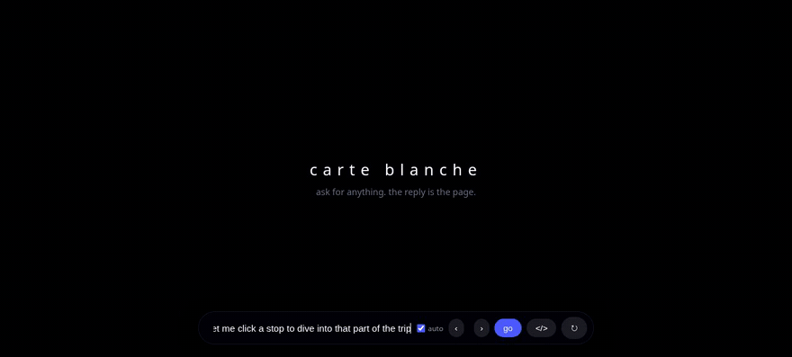
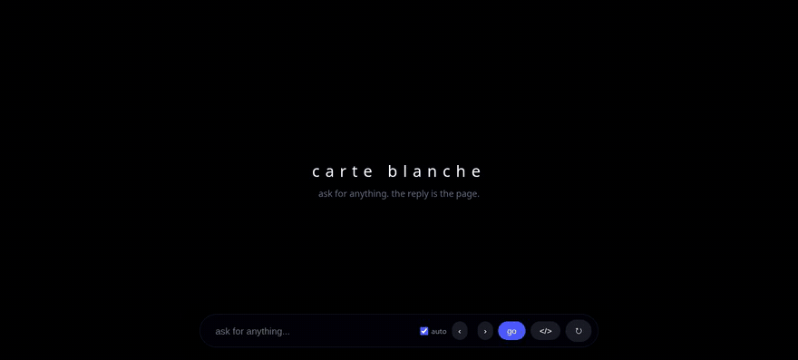
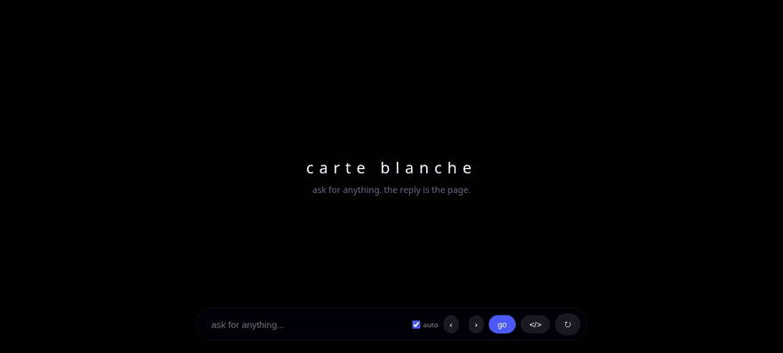
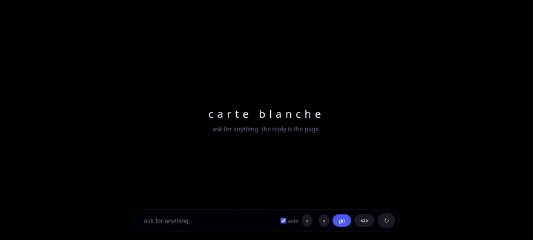
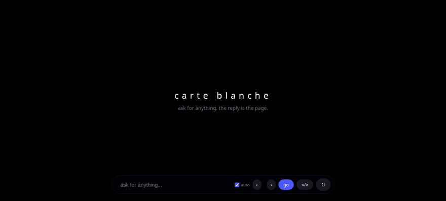

# carte-blanche-chat

🐈

every reply is a full webpage. no chat pane, no components - the model renders the entire viewport, then you talk to the page.

## quickstart

needs python 3.11+ and an anthropic api key. node 20+ only if you want the nice chrome.

- `git clone https://github.com/arnav-exe/carte-blanche-chat && cd carte-blanche-chat`
- `python3 -m venv .venv && .venv/bin/pip install -r requirements.txt`
- `.venv/bin/playwright install chromium` (powers the visual review loop - skip and set `REVIEW=off` if you dont want it)
- `cd host && npm install && npm run build && cd ..` (the svelte chrome - skipping falls back to a basic v1 shell)
- create `.env` in the repo root: `ANTHROPIC_API_KEY=sk-ant-...`
- `.venv/bin/uvicorn main:app --app-dir server --reload`
- open http://localhost:8000 and ask for anything

first turn note: with `REVIEW=blocking` (the default) every turn ends with a vision model screenshotting the rendered page and demanding fixes - expect ~20-40s extra per turn, and occasionally a visible "revising" pass where the page re-renders corrected. `REVIEW=off` for fast/cheap hacking.

hacking on the chrome: `cd host && npm run dev` gives hot-reload on :5173, proxied to the backend on :8000.

### knobs

- `.env`: `MODEL=claude-sonnet-5` (cheap dev, default is opus) · `EFFORT=low` · `MAX_TOKENS=24000` · `THEME=<daisyui theme>` · `PIPELINE=staged` + `BRIEF_MODEL=...` (creative-director brief, then a renderer) · `REVIEW=blocking|off` + `REVIEW_MODEL=...` · `FIXTURE=runs/<run>/stream.jsonl` (replay a recorded stream, zero api calls - point it at a dir of jsonl files to cycle them per turn)
- url params: `?mode=raw` (same-dom rendering w/ cleanup instrumentation, true element morphs) · `?mode=raw-bare` (no guardrails at all, for the chaos) · `?libs=allowlist` (csp-pin generated pages to the library toolbox)

## demos

exact prompts/interactions used, in order. demos 1-3 are one continuous conversation on `claude-opus-5` (EFFORT=medium).

### 1. the globe

> plan me a 10 day trip through japan - show the route on an interactive 3d globe with my stops marked and connected, and let me click a stop to dive into that part of the trip

### 2. click a stop

no typed prompt - clicked the kyoto marker on the globe. the page emitted the event, which became the next turn automatically:

> [ui event] action=select_stop label="Kyoto" data={"id":"kyoto"}

### 3. aesthetic flip

> make this whole thing a retro terminal

### 4. time travel

no prompt - the ‹ › scrubber in the dock plus the browser's back/forward buttons. every turn is a self-contained html document, so history re-renders live.

### 5. break it, fix it

> a tiny gallery page

(served from a fixture with a planted bug - `initCarousel()` undefined + a dead image url.) the page's error surfaces as a ⚠ fix-it chip; clicking it sent, on `claude-sonnet-5`:

> [page error] Uncaught ReferenceError: initCarousel is not defined (line 1) - the page you rendered threw at runtime. fix the bug and re-render the corrected page.
